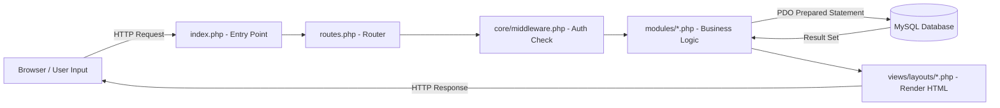
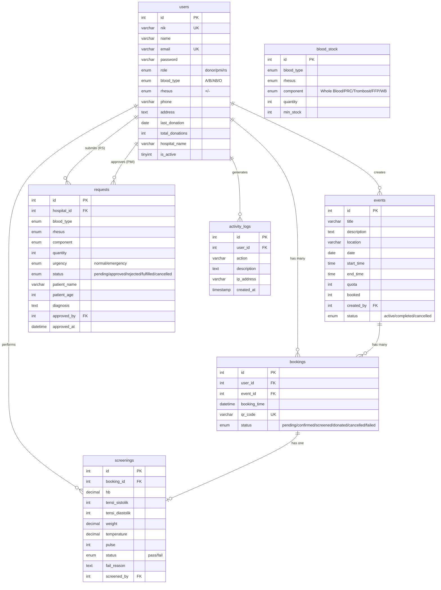
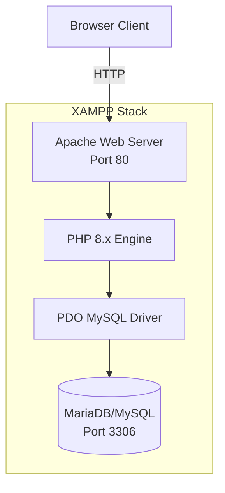
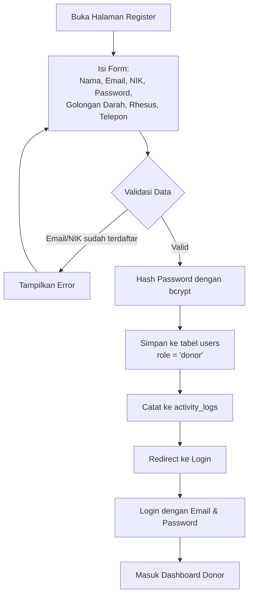
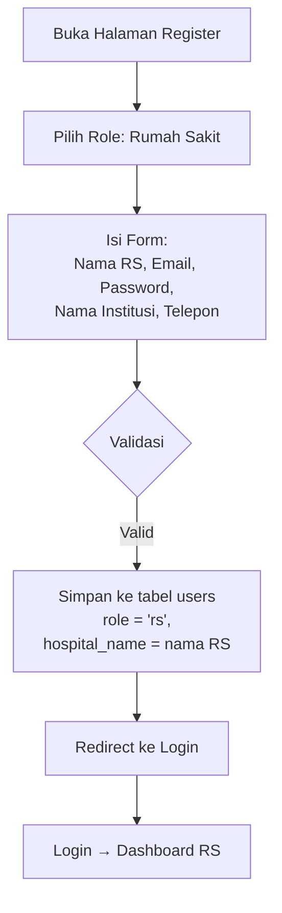
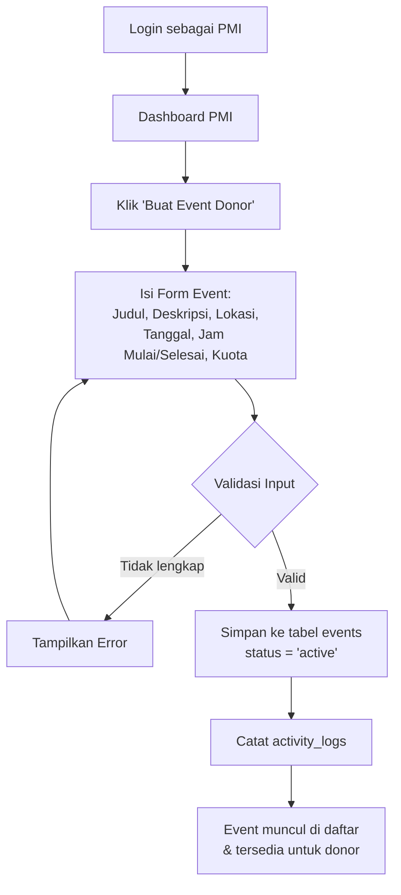
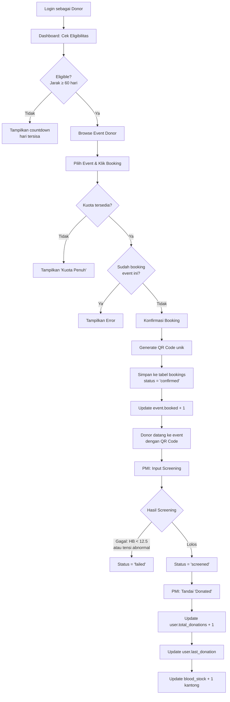
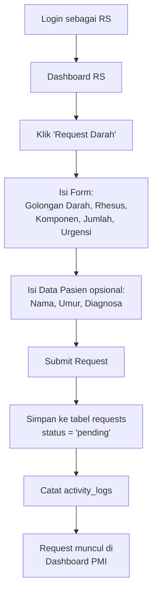
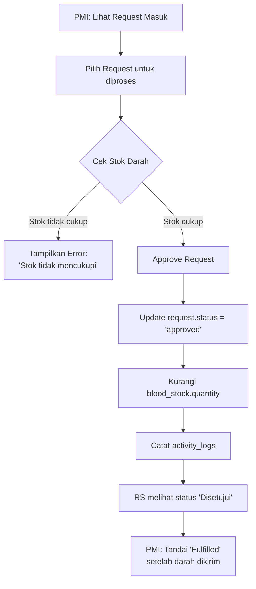
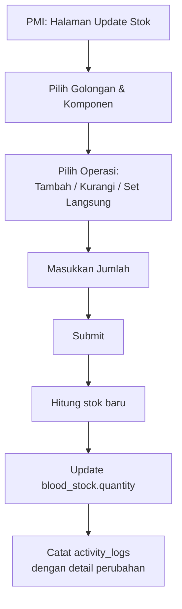

# 📋 Dokumentasi Sistem E-BloodBank
**Sistem Manajemen Donor Darah Digital**

---

## A. Arsitektur Sistem

### Tipe Arsitektur: Monolitik (Monolithic)
E-BloodBank menggunakan arsitektur **monolitik** — seluruh komponen (routing, logika bisnis, akses data, dan tampilan) berada dalam satu codebase PHP yang sama.

### Teknologi yang Digunakan

| Layer | Teknologi |
|-------|-----------|
| **Frontend** | HTML5, Vanilla CSS, Vanilla JavaScript |
| **Backend** | PHP 8.x (Native, tanpa framework) |
| **Database** | MySQL/MariaDB via PDO |
| **Web Server** | Apache (XAMPP) |
| **Styling** | Custom CSS (~16.6KB) dengan design system sendiri |

### Alur Data: Input Pengguna → Database



**Alur detail:**
1. **User** mengisi form dan menekan submit di browser
2. **`index.php`** menerima request, memulai session, memuat `core/auth.php` dan `core/helper.php`
3. **`routes.php`** membaca parameter `?page=xxx`, memvalidasi akses (public vs protected), lalu me-route ke file module yang sesuai
4. **Middleware** (`core/middleware.php`) memverifikasi role pengguna via `guardRole()`, `guardPMI()`, `guardRS()`, atau `guardDonor()`
5. **Module** (misal `modules/booking/create.php`) memproses logika bisnis, menggunakan **PDO Prepared Statements** untuk query ke database
6. **Database** menyimpan data dan mengembalikan hasil
7. **View** (`views/layouts/header.php` + `footer.php`) membungkus output HTML yang dikirim kembali ke browser
8. Setiap aksi penting dicatat ke tabel `activity_logs` via fungsi `logActivity()`

---

## B. Fitur dan Model Utama

### Role 1: Admin PMI (`role = 'pmi'`)

| No | Fitur | Deskripsi |
|----|-------|-----------|
| 1 | Dashboard PMI | Ringkasan statistik: total donor, kantong darah, request menunggu, perlu screening |
| 2 | Kelola Event Donor | CRUD event donor: buat, edit, hapus, lihat daftar event |
| 3 | Manajemen Stok Darah | Lihat stok per golongan/komponen, update stok (tambah/kurangi/set langsung) |
| 4 | Input Screening | Input hasil pemeriksaan kesehatan donor (HB, tensi, suhu, nadi, berat badan) |
| 5 | Verifikasi Donor Selesai | Tandai booking sebagai "donated", otomatis tambah stok darah |
| 6 | Proses Request RS | Approve/reject permintaan darah dari RS, cek ketersediaan stok |
| 7 | Fulfill Request | Tandai request yang sudah terpenuhi |
| 8 | Manajemen User | Lihat, cari, filter semua pengguna dengan pagination |
| 9 | Laporan & Statistik | Grafik donasi bulanan, top donor, ringkasan request, stok |
| 10 | Export Data | Export CSV (donasi, stok, request) dan Export PDF |

### Role 2: Rumah Sakit (`role = 'rs'`)

| No | Fitur | Deskripsi |
|----|-------|-----------|
| 1 | Dashboard RS | Statistik request (menunggu, disetujui, terpenuhi), stok darah real-time |
| 2 | Lihat Stok Darah PMI | Melihat ketersediaan stok darah PMI secara real-time |
| 3 | Request Darah Normal | Mengajukan permintaan darah dengan data pasien (nama, umur, diagnosa) |
| 4 | Request Darah Emergency | Mengajukan permintaan darurat yang diprioritaskan PMI |
| 5 | Riwayat Request | Melihat semua histori request beserta statusnya |

### Role 3: Pendonor (`role = 'donor'`)

| No | Fitur | Deskripsi |
|----|-------|-----------|
| 1 | Dashboard Donor | Status eligibilitas, statistik donor pribadi, level donor (Bronze/Silver/Gold) |
| 2 | Lihat Event Donor | Browse event donor yang tersedia beserta kuota |
| 3 | Booking Event | Pesan tempat di event donor, mendapat QR Code unik |
| 4 | Booking Saya | Lihat daftar booking aktif dan statusnya |
| 5 | Batalkan Booking | Membatalkan booking yang masih pending/confirmed |
| 6 | Riwayat Donor | Melihat histori seluruh donasi yang pernah dilakukan |
| 7 | Profil | Edit data diri (nama, telepon, alamat, golongan darah) |
| 8 | Cek Ketersediaan Darah | Melihat ringkasan stok darah yang tersedia |

---

## C. Manajemen dan Keamanan Data

### Struktur Database

Sistem menggunakan **7 tabel utama** dengan relasi foreign key:



### Mekanisme Keamanan

| Aspek | Implementasi |
|-------|-------------|
| **Autentikasi** | Session-based authentication. Login via email + password. Password di-hash menggunakan `password_hash()` (bcrypt, `PASSWORD_DEFAULT`) |
| **Enkripsi Password** | Bcrypt hashing via PHP `password_hash()` / `password_verify()` |
| **RBAC** | Role-Based Access Control dengan 3 role (`donor`, `pmi`, `rs`). Setiap route dilindungi oleh `requireRole()` / `guardRole()` |
| **CSRF Protection** | Token CSRF menggunakan `bin2hex(random_bytes(32))`, diverifikasi via `verifyCSRF()` |
| **Input Sanitization** | Fungsi `sanitize()` menggunakan `htmlspecialchars()` + `strip_tags()` + `trim()` untuk mencegah XSS |
| **SQL Injection Prevention** | Semua query menggunakan PDO Prepared Statements |
| **Rate Limiting** | Session-based rate limiter (`rateLimit()`) untuk mencegah brute-force |
| **Audit Trail** | Semua aksi penting dicatat di tabel `activity_logs` (user_id, action, description, IP address, timestamp) |
| **Route Protection** | Route non-publik otomatis redirect ke login jika user belum terautentikasi |
| **Validasi Unik** | Email dan NIK divalidasi unik saat registrasi |
| **Account Status** | Field `is_active` untuk menonaktifkan akun tanpa menghapus data |

---

## D. Interoperabilitas dan Standar

### Status Saat Ini
Sistem E-BloodBank **belum mengimplementasikan** standar pertukaran data kesehatan seperti:
- **HL7** (Health Level Seven)
- **FHIR** (Fast Healthcare Interoperability Resources)
- **DICOM** (Digital Imaging and Communications in Medicine — tidak relevan untuk sistem bank darah)

### Rencana Integrasi

| Sistem Eksternal | Rencana |
|-----------------|---------|
| **SATUSEHAT** | Integrasi via FHIR API untuk sinkronisasi data donor dan stok darah ke platform nasional Kemenkes |
| **BPJS Kesehatan** | Verifikasi kepesertaan BPJS untuk pasien penerima darah, mempercepat proses administrasi |
| **Faskes Lain** | API REST untuk pertukaran data stok darah antar PMI cabang dan rumah sakit mitra |
| **NIK Verification** | Integrasi dengan Dukcapil untuk validasi NIK pendonor |

### Langkah Pengembangan Interoperabilitas
1. Membangun **REST API layer** untuk expose data stok darah dan request
2. Mengadopsi **FHIR Resources** (Patient, Specimen, ServiceRequest) untuk standarisasi format data
3. Implementasi **OAuth 2.0** untuk autentikasi antar sistem
4. Mapping data internal ke terminologi standar (SNOMED CT, LOINC)

---

## E. Peran Pengguna (User Role) & RBAC

### Daftar Pengguna

| Role | Pengguna | Deskripsi |
|------|----------|-----------|
| `pmi` | Admin PMI | Pengelola utama sistem, mengelola event, stok, screening, dan request |
| `rs` | Admin Rumah Sakit | Pihak RS yang meminta suplai darah dari PMI |
| `donor` | Pendonor | Masyarakat yang ingin mendonorkan darah |

### Matriks Hak Akses RBAC

| Fitur / Halaman | PMI | RS | Donor |
|-----------------|:---:|:--:|:-----:|
| Dashboard sendiri | ✅ | ✅ | ✅ |
| Kelola Event (CRUD) | ✅ | ❌ | ❌ |
| Lihat Event | ✅ | ❌ | ✅ |
| Booking Event | ❌ | ❌ | ✅ |
| Lihat Booking Sendiri | ❌ | ❌ | ✅ |
| Input Screening | ✅ | ❌ | ❌ |
| Kelola Stok Darah | ✅ | ❌ | ❌ |
| Lihat Stok Darah | ✅ | ✅ | ✅ |
| Request Darah | ❌ | ✅ | ❌ |
| Approve/Reject Request | ✅ | ❌ | ❌ |
| Riwayat Request | ✅ | ✅ | ❌ |
| Manajemen User | ✅ | ❌ | ❌ |
| Laporan & Export | ✅ | ❌ | ❌ |
| Edit Profil | ✅ | ❌ | ✅ |
| Riwayat Donor | ❌ | ❌ | ✅ |

### Implementasi RBAC dalam Kode

```php
// Middleware functions (core/middleware.php)
function guardRole(array $allowedRoles) {
    if (!isLoggedIn()) { redirect('/login'); }
    if (!in_array($_SESSION['user_role'], $allowedRoles)) {
        redirect('/dashboard'); // Access denied
    }
}
function guardPMI()   { guardRole(['pmi']); }
function guardRS()    { guardRole(['rs']); }
function guardDonor() { guardRole(['donor']); }

// Digunakan di setiap module:
requireRole('pmi');   // Hanya PMI yang bisa akses
requireRole('rs');    // Hanya RS yang bisa akses
requireRole('donor'); // Hanya Donor yang bisa akses
```

---

## F. Infrastruktur dan Deployment

### Lingkungan Deployment

| Aspek | Detail |
|-------|--------|
| **Tipe Hosting** | Hosting Lokal (Local Development Server) |
| **Platform** | XAMPP on Windows |
| **Web Server** | Apache HTTP Server (bundled XAMPP) |
| **PHP Version** | PHP 8.x |
| **Database Server** | MariaDB/MySQL (bundled XAMPP) |
| **URL Akses** | `http://localhost/ebloodbank/` |

### Teknologi Server



### Availability & Keandalan

| Mekanisme | Detail |
|-----------|--------|
| **Error Handling** | Try-catch pada koneksi database dengan pesan error yang informatif |
| **Singleton Pattern** | Koneksi database menggunakan static variable untuk menghindari koneksi berulang |
| **PDO Error Mode** | `ERRMODE_EXCEPTION` untuk menangkap semua error database |
| **Session Management** | Pengecekan `session_status()` sebelum `session_start()` untuk menghindari konflik |
| **Graceful Degradation** | Activity logging gagal secara silent (`catch` tanpa die) agar tidak mengganggu operasi utama |

### Rencana Scaling
Untuk production, direkomendasikan:
- Migrasi ke **VPS/Cloud** (AWS EC2, DigitalOcean, atau IDCloudHost)
- Menggunakan **Nginx** sebagai reverse proxy
- Setup **SSL/TLS** certificate untuk HTTPS
- Implementasi **database backup** otomatis
- Monitoring via **uptime checker**

---

## G. Alur Kerja dan Use Case Utama

### 1. Alur Pendaftaran Pendonor



### 2. Alur Pendaftaran Rumah Sakit



### 3. Alur Pembuatan Event Donor oleh Admin PMI



### 4. Alur Donor Darah oleh Pendonor



### 5. Alur Pengajuan Permintaan Darah oleh RS



### 6. Alur Approve Request oleh Admin PMI



### 7. Alur Update Stok Darah oleh Admin PMI



---

## H. Desain Database

### Tabel-Tabel Utama dan Relasinya

| No | Tabel | Fungsi | Jumlah Kolom |
|----|-------|--------|:------------:|
| 1 | `users` | Menyimpan data semua pengguna (donor, PMI, RS) | 17 |
| 2 | `events` | Menyimpan data event donor darah | 12 |
| 3 | `bookings` | Menyimpan data booking/reservasi donor | 9 |
| 4 | `blood_stock` | Menyimpan stok darah per golongan dan komponen | 7 |
| 5 | `requests` | Menyimpan permintaan darah dari RS | 14 |
| 6 | `screenings` | Menyimpan hasil pemeriksaan kesehatan donor | 11 |
| 7 | `activity_logs` | Menyimpan log aktivitas pengguna (audit trail) | 5 |

### Relasi Antar Tabel

| Relasi | Tipe | Keterangan |
|--------|------|------------|
| `users` → `events` | One-to-Many | Satu PMI admin membuat banyak event (`created_by`) |
| `users` → `bookings` | One-to-Many | Satu donor memiliki banyak booking (`user_id`) |
| `events` → `bookings` | One-to-Many | Satu event memiliki banyak booking (`event_id`) |
| `bookings` → `screenings` | One-to-One | Satu booking memiliki satu hasil screening (`booking_id`) |
| `users` → `requests` | One-to-Many | Satu RS mengajukan banyak request (`hospital_id`) |
| `users` → `requests` | One-to-Many | Satu PMI menyetujui banyak request (`approved_by`) |
| `users` → `screenings` | One-to-Many | Satu PMI melakukan banyak screening (`screened_by`) |
| `users` → `activity_logs` | One-to-Many | Satu user menghasilkan banyak log (`user_id`) |

### Constraint & Index

| Tabel | Constraint |
|-------|-----------|
| `users` | UNIQUE: `email`, `nik` |
| `bookings` | UNIQUE: `qr_code` |
| `blood_stock` | UNIQUE KEY: `(blood_type, rhesus, component)` |
| Semua FK | ON DELETE CASCADE / SET NULL |
| Semua tabel | ENGINE = InnoDB (mendukung transaksi & foreign key) |

---

## I. Kesimpulan dan Pengembangan Lanjut

### ✅ Yang Sudah Dicapai

1. **Sistem Multi-Role Lengkap** — Tiga role (PMI, RS, Donor) dengan dashboard dan fitur masing-masing
2. **Manajemen Event Donor** — CRUD lengkap dengan sistem kuota dan booking
3. **Booking dengan QR Code** — Sistem reservasi dengan kode unik untuk setiap booking
4. **Screening Kesehatan** — Input dan validasi otomatis hasil pemeriksaan (HB, tensi, suhu, nadi)
5. **Manajemen Stok Darah** — Tracking stok per golongan darah dan komponen (Whole Blood, PRC, Trombosit, FFP)
6. **Request Darah RS** — Sistem permintaan dengan level urgensi (normal/emergency) dan workflow approval
7. **Auto Stock Management** — Stok otomatis bertambah saat donor selesai, berkurang saat request disetujui
8. **Audit Trail** — Pencatatan lengkap semua aktivitas pengguna dengan IP address
9. **Laporan & Export** — Dashboard statistik, export CSV dan PDF
10. **Keamanan** — Bcrypt hashing, PDO prepared statements, CSRF protection, RBAC, input sanitization, rate limiting
11. **UI/UX Modern** — Design system dengan sidebar navigation, responsive layout, status badges, progress bars
12. **Eligibility Check** — Pengecekan otomatis kelayakan donor (jarak minimal 60 hari)
13. **Level/Gamifikasi Donor** — Sistem level Bronze/Silver/Gold berdasarkan jumlah donasi

### 🔮 Rencana Fitur ke Depan

| Prioritas | Fitur | Deskripsi |
|:---------:|-------|-----------|
| 🔴 Tinggi | Notifikasi Real-time | Push notification untuk status request, reminder event |
| 🔴 Tinggi | API REST | Membangun API layer untuk integrasi sistem eksternal |
| 🟡 Sedang | Integrasi SATUSEHAT | Koneksi ke platform nasional Kemenkes via FHIR |
| 🟡 Sedang | QR Code Scanner | Scan QR code saat donor datang ke event |
| 🟡 Sedang | Verifikasi Email | OTP/email verification saat registrasi |
| 🟡 Sedang | Two-Factor Auth | Keamanan tambahan untuk akun admin |
| 🟢 Rendah | Mobile App | Aplikasi mobile untuk donor (React Native/Flutter) |
| 🟢 Rendah | Chat/Messaging | Komunikasi langsung antara RS dan PMI |
| 🟢 Rendah | Donor Rewards | Sistem reward point dan achievement |
| 🟢 Rendah | Blood Drive Map | Peta interaktif lokasi event donor |
| 🟢 Rendah | Integrasi BPJS | Verifikasi kepesertaan BPJS pasien |
| 🟢 Rendah | Multi-Cabang PMI | Dukungan untuk banyak cabang PMI |

---

*Dokumentasi ini dibuat berdasarkan analisis kode sumber E-BloodBank.*
*Terakhir diperbarui: 18 Mei 2026*
